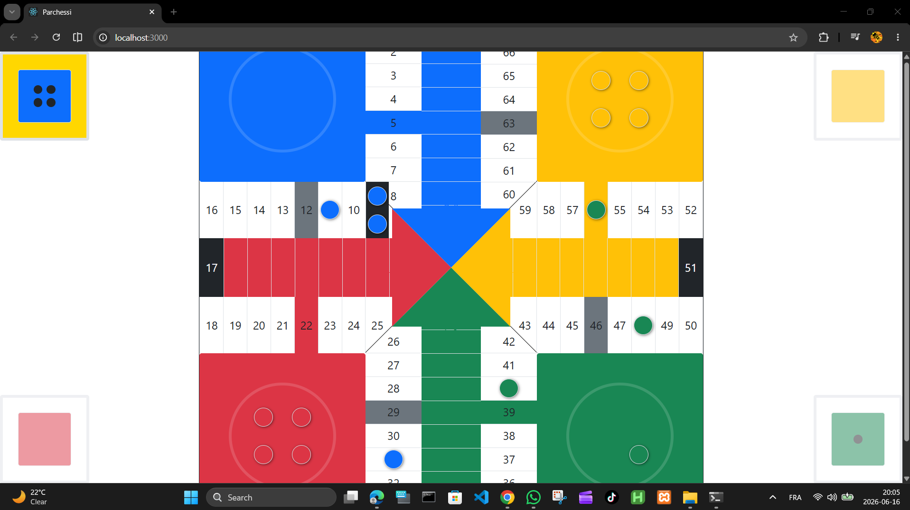
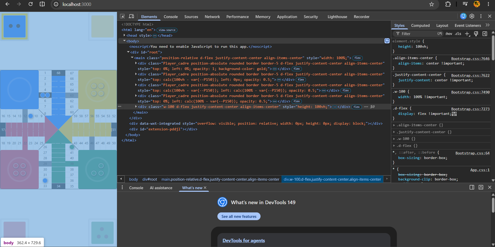

# Parchís Algo

[](https://redafarissi.github.io/parchessi-algo/)
[](https://reactjs.org/)

Application React.js représentant une version hors ligne du jeu Parchís pour deux joueurs.

## 🎮 Démo en ligne

**[👉 Jouer maintenant](https://redafarissi.github.io/parchessi-algo/)**

## Description

Projet personnel développé afin de reproduire la logique du jeu Parchís en React.js.

L'application permet à deux joueurs de jouer localement sur le même appareil sans connexion Internet.

## Fonctionnalités

- Jeu local pour 2 joueurs
- Gestion des tours
- Déplacement des pions
- Captures des pions adverses
- Validation des mouvements
- Gestion des conditions de victoire
- Interface interactive du plateau

## Technologies utilisées

- React.js
- JavaScript
- HTML5
- CSS3

## Captures d'écran




## Installation
Cloner le projet :

```bash
git clone https://github.com/RedaFarissi/parchessi-algo.git
```

Accéder au dossier :

```bash
cd parchessi-algo
```

Installer les dépendances :

```bash
npm install
```

Lancer l'application :

```bash
npm start
```

L'application sera accessible sur :

```text
http://localhost:3000
```

## Objectif du projet

Ce projet a été réalisé dans le cadre de mon apprentissage de React.js et du développement d'algorithmes de gestion d'état complexes.

## Auteur

Reda Eskouni

GitHub :
https://github.com/RedaFarissi
